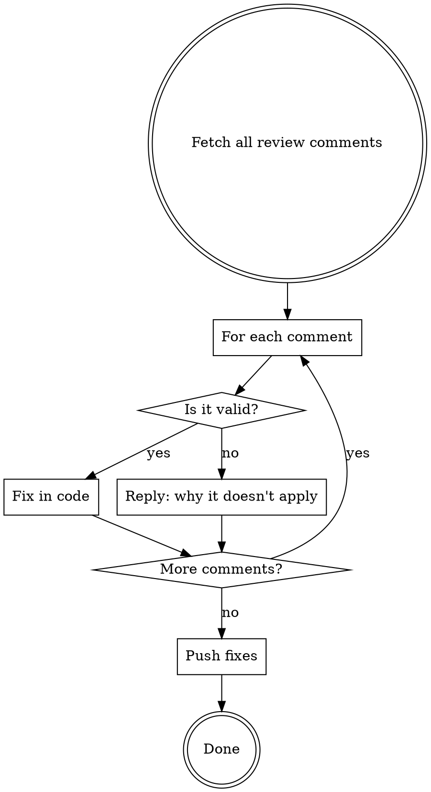

# Addressing Review Comments

## The Rule

**Valid issues: fix silently.** The code change speaks for itself.

**Declined issues: MUST reply on the PR.** If a comment is a false positive or non-applicable, the reviewer must see WHY you didn't act on it. Silent ignoring is not acceptable.

## Process



### Step 1: Read and classify ALL comments

Read every comment before fixing anything. Classify each:
- **Valid** — fix in code, no reply needed
- **False positive** — reviewer misread the code or missed context, reply required
- **Non-applicable** — technically correct but wrong for this context, reply required
- **Duplicate** — same issue across review rounds, already fixed, no reply needed

### Step 2: Fix valid issues in code

Apply fixes. Group related fixes into logical commits.

### Step 3: Reply to declined comments only

For false positives and non-applicable items, reply inline via `gh api`:

```bash
gh api repos/OWNER/REPO/pulls/PR_NUMBER/comments/COMMENT_ID/replies \
  -f body="REPLY_TEXT"
```

Keep replies short and evidence-based:
- "Drizzle ORM auto-parameterizes all values, no injection risk."
- "This component only re-renders on navigation, memoization adds complexity for zero benefit."
- "Per project convention, ISO date strings compare correctly with < operator."

**No filler.** No "Thanks for flagging", no "Good catch but". Just the reason.

### Step 4: Push

Push code fixes.

## Red Flags — STOP

| Thought | Reality |
|---------|---------|
| "I'll just fix everything to be safe" | Fixing a non-issue adds unnecessary complexity |
| "Not worth explaining why I'm declining" | Silent ignoring leaves the reviewer wondering |
| "It's an automated tool, nobody reads replies" | The human reviewing the PR reads them to verify |
| "I'll post one summary comment instead" | Reply inline per-comment, not a batch summary |
