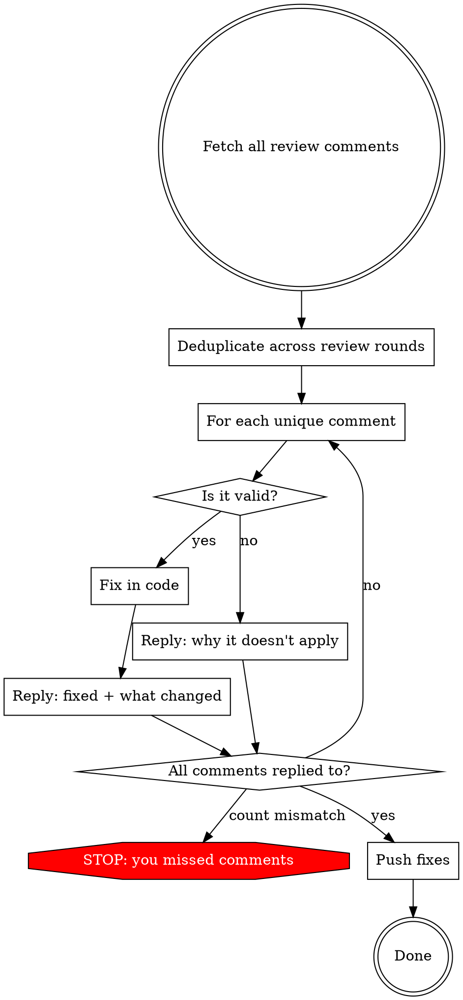

# Addressing Review Comments

## The Rule

**Every review comment MUST get a reply on the PR.** Fixing code silently is not addressing a comment. The reviewer must see that their feedback was read, evaluated, and either acted on or respectfully declined with reasoning.

**Violating the letter of this rule is violating the spirit.** There is no scenario where silently skipping a reply is acceptable.

## Process



### Step 1: Fetch and deduplicate ALL comments

Use `mcp__github__get_pull_request_comments` or `gh api` to get every inline review comment. When multiple review rounds exist (common with automated tools like cubic), deduplicate:
- Same file + same issue flagged across rounds → reply to the **latest** instance, mark earlier ones as "Addressed in reply to latest round"
- Same issue but different file locations → treat as separate comments

**Get comment IDs:** Each comment object has an `id` field. You need this to reply inline.

### Step 2: Classify each comment

Before fixing anything, read every comment. Group them:
- **Valid** — real bug, real improvement needed
- **False positive** — reviewer misread the code or missed context
- **Non-applicable** — technically correct observation but wrong for this context (premature optimization, already handled by framework, project convention differs, etc.)
- **Duplicate** — same issue flagged across review rounds, already fixed in a later commit

### Step 3: Fix valid issues in code

Apply fixes. Group related fixes into logical commits.

### Step 4: Reply to EVERY comment on the PR

Reply inline on each comment thread. Use `gh api`:

```bash
gh api repos/OWNER/REPO/pulls/PR_NUMBER/comments/COMMENT_ID/replies \
  -f body="REPLY_TEXT"
```

**For valid issues you fixed:**
> Fixed — [brief description of what changed].

**For false positives:**
> Not an issue — [specific reason with evidence]. Example: "The query uses Drizzle ORM which auto-parameterizes all values, so SQL injection isn't a risk here."

**For non-applicable:**
> Acknowledged, but not changing — [reason]. Example: "This component only re-renders on navigation, so memoization would add complexity without measurable benefit."

**For duplicates across review rounds:**
> Already addressed in [commit SHA or earlier fix description].

### Step 5: Verify and push

**Before pushing, count:** total comments (including duplicates) = number of replies posted. If they don't match, you missed one. Go back.

Push code fixes after all replies are posted.

## Reply Quality

- **Specific** — reference the actual code, not generic reassurance
- **Evidence-based** — "Drizzle auto-parameterizes" not "it's fine"
- **Respectful** — acknowledge the reviewer's concern before explaining
- **Concise** — 1-3 sentences, not essays

## Red Flags — STOP

If you catch yourself thinking any of these, you are about to skip commenting:

| Thought | Reality |
|---------|---------|
| "I'll just fix and push" | Fixing without replying leaves the reviewer blind |
| "The code change speaks for itself" | Reviewers can't tell which comments were addressed vs ignored |
| "I'll reply after I push" | You won't. Reply as you go. |
| "This comment isn't worth replying to" | Every comment deserves acknowledgment |
| "There are too many comments" | More reason to reply — the reviewer needs a trail |
| "It's an automated tool, nobody reads replies" | The human reviewing the PR reads them to verify |
| "I'll post one summary comment instead" | Reply inline per-comment. Reviewers track per-thread. |
| "Some of these are duplicates, I'll skip them" | Reply to duplicates too — "Already addressed in X" |

## Common Mistakes

**Replying only to declined comments.** Reply to ALL — including ones you fixed. The reviewer needs to see "Fixed" to close their mental loop.

**Generic replies.** "Addressed" or "Fixed" without saying what changed. Be specific.

**Batch reply in a single PR comment.** Reply inline on each comment thread, not in one giant summary comment. Reviewers track conversations per-comment.

**Ignoring earlier review rounds.** When a PR has multiple review rounds, comments from earlier rounds still need replies if they weren't already answered.
